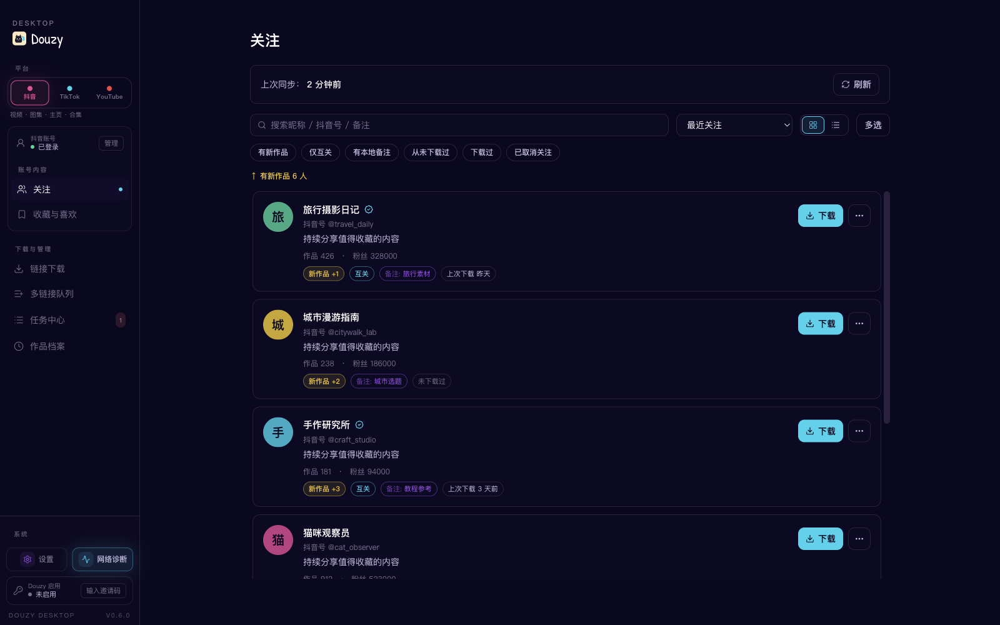
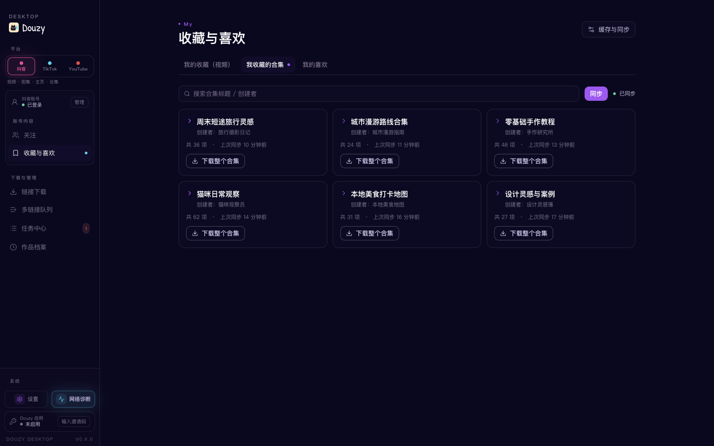
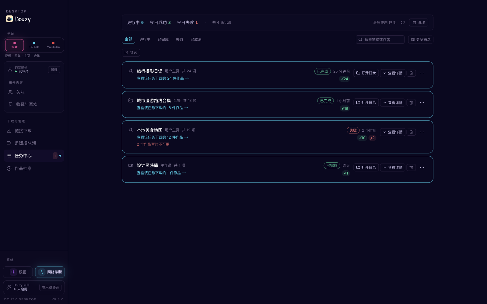

# Douyin Downloader V2.0

  

A practical Douyin downloader supporting videos, image-notes, collections, music, favorites collections, and profile batch downloads, with progress display, retries, SQLite deduplication, download integrity checks, and browser fallback support.

## Desktop App (Douzy)

A desktop GUI built on the same backend, with dedicated workspaces for Douyin, TikTok, and YouTube. Paste a link to start, sync account content, follow every task, and manage downloaded works in a local archive.

- **Three platforms:** Douyin videos, galleries, profiles, and collections; TikTok videos, photos, and profiles; YouTube videos, Shorts, channels, and playlists
- **Account content:** sync Douyin following, favorites collections, collected series, and likes
- **Visual workflow:** multi-link queue, task status and retry controls, local download archive, filters, and quick re-download

| **Douyin link download** | **TikTok download workspace** | **YouTube workbench** |
|:---:|:---:|:---:|
|  |  |  |
| Paste a video, gallery, profile, or collection link and start in one click. | Download public videos, photo posts, and profiles without signing in. | Scan videos, Shorts, channels, and playlists, then configure video, MP3, or subtitle downloads. |
| **Following management** | **Favorites and likes** | **Task Center** |
|  |  |  |
| Sync creators, filter new works, add notes, and download directly from the list. | Browse collected videos, series, and liked works from the current Douyin account. | Track job results, retry failures, and open output folders. |

## Install

[View all releases](../../releases)

| Platform | Download | Run |
|----------|----------|-----|
| **Windows x64** | [douyin-downloader-x64.7z](../../releases) | Run installer → launch `douyin-downloader-x64.7z` |
| **Linux x64** | [douyin-downloader-Linux-x64.run](../../releases) | `chmod +x` → run installer |
| **macOS Apple Silicon** | [douyin-downloader-macOS-arm64.dmg](../../releases) | Open DMG → drag to Applications |

## Feature Overview

### Supported

| Feature | Description |
|---------|-------------|
| Single video download | `/video/{aweme_id}` |
| Single image-note download | `/note/{note_id}` and `/gallery/{note_id}` |
| Single collection download | `/collection/{mix_id}` and `/mix/{mix_id}` |
| Single music download | `/music/{music_id}` (prefers direct audio, fallback to first related aweme) |
| Short link parsing | `https://v.douyin.com/...`, `v.iesdouyin.com`, bare hosts |
| Profile batch download | `/user/{sec_uid}` + `mode: [post, like, mix, music]` |
| Logged-in favorites collections | `/user/self?showTab=favorite_collection` + `mode: [collect, collectmix]` |
| No-watermark preferred | Automatically selects watermark-free video source |
| Highest-quality selection | Auto-picks highest bitrate from `video.bit_rate` ladder (video + live-photo) |
| **Live stream recording** | `live.douyin.com/{room_id}` → FLV/HLS, preserves partial data on stream end |
| **Comments collection** | Per-aweme comments (+ optional replies) saved as `*_comments.json` |
| **Hot search + keyword search** | `--hot-board [N]` / `--search "keyword"` dumps to JSONL |
| **REST API server mode** | `--serve --serve-port 8000` (optional `fastapi + uvicorn`) |
| **Notification push** | Bark / Telegram / Webhook on download completion |
| Extra assets | Cover, music, avatar, JSON metadata |
| Video transcription | Optional, using OpenAI Transcriptions API |
| Concurrent downloads | Configurable concurrency, default 5 |
| Retry with backoff | Exponential backoff (1s, 2s, 5s) |
| Rate limiting | Default 2 req/s |
| SQLite history | Records download metadata; does not decide incremental skips |
| Incremental downloads | Disk-based skip/redownload via `increase.post/like/mix/music` |
| Time filters | `start_time` / `end_time` |
| Browser fallback | Launches browser when pagination is blocked, manual CAPTCHA supported |
| Download integrity check | Content-Length validation, auto-cleanup of incomplete files |
| Progress display | Rich progress bars, supports `progress.quiet_logs` quiet mode |
| Docker deployment | Dockerfile included |
| CI/CD | GitHub Actions for testing and linting |

### Current Limitations

- Browser fallback is fully validated for `post`; `like/mix/music` currently relies on API pagination
- `number.allmix` / `increase.allmix` are retained as compatibility aliases and normalized to `mix`
- `collect` / `collectmix` currently work for the account represented by the logged-in cookies only
- `collect` / `collectmix` must be used alone and cannot be combined with `post` / `like` / `mix` / `music`
- `increase` currently applies to `post` / `like` / `mix` / `music`; favorites collection modes do not support incremental stop
- Live stream recording saves FLV natively; HLS sources only save the playlist (use ffmpeg for playable output)
- The webcast room endpoint is not verified against every live scenario — treat as experimental

## Disclaimer

This project is for technical research, learning, and personal data management only. Please use it legally and responsibly:

- Do not use it to infringe others' privacy, copyright, or other legal rights
- Do not use it for any illegal purpose
- Users are solely responsible for all risks and liabilities arising from usage
- If platform policies or interfaces change and features break, this is a normal technical risk

By continuing to use this project, you acknowledge and accept the statements above.

## License

This project is licensed under the MIT License. See [LICENSE](./LICENSE) for details.
